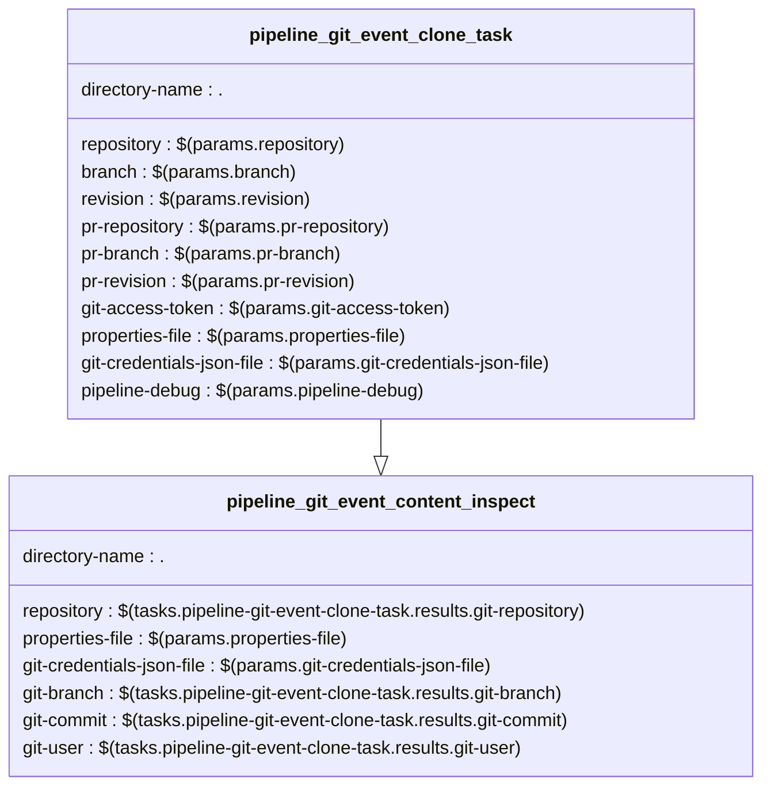

#Tekton documentation

----
##1- Pipeline 
###1- Pipeline's params details
| NAME   |      DEFAULT      |  DESCRIPTION |
|----------|-------------|----------------------|
| repository | / | the git repo |
| branch | / | the branch for the git repo |
| revision |  | the commit id/sha for the clone action |
| pr-repository |  | The source git repo for the PullRequest |
| pr-branch |  | The source branch for the PullRequest |
| pr-revision |  | the commit id/sha for the PullRequest |
| git-access-token |  | the token to access the git repository for the clone operations |
| properties-file | output/thebuild.properties | / |
| git-credentials-json-file | output/secrets/thecredentials.json | / |
| pipeline-debug | 0 | / |
### 2- Tasks 's details

