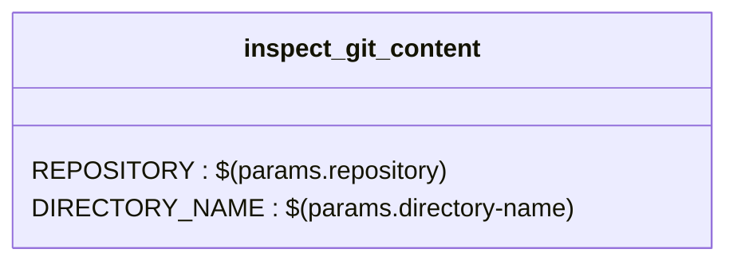

#Tekton documentation

----
##1- Task 
###1- Task's params details
| NAME   |      DEFAULT      |  DESCRIPTION |
|----------|-------------|----------------------|
| repository | / | the git repo url |
| directory-name | . | / |
| properties-file | build.properties | / |
| git-credentials-json-file |  | / |
| git-branch | / | The active branch for the repository |
| git-commit | / | The current commit id that was cloned |
| git-user | / | The auth user that cloned the repository |
### 2- Steps 's details

